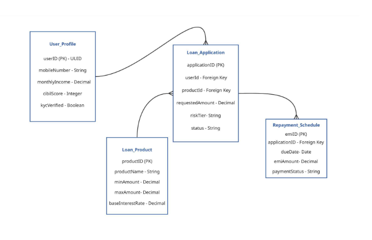

# 🗄️ Schema Design — KreditBee

## 📌 Objective

To design a scalable and structured database schema that supports KreditBee’s core functionalities including loan applications, underwriting, and repayment tracking.

---

## 🧱 Key Entities and Attributes

### 1. User_Profile Table

| Attribute     | Type               | Description                                 |
| ------------- | ------------------ | ------------------------------------------- |
| userID        | Primary Key (UUID) | Unique identifier for each user             |
| mobileNumber  | String             | Registered phone number                     |
| monthlyIncome | Decimal            | User’s declared or verified income          |
| cibilScore    | Integer            | Credit score (null for new-to-credit users) |
| kycVerified   | Boolean            | Aadhaar/PAN verification status             |

---

### 2. Loan_Product Table

| Attribute        | Type        | Description                 |
| ---------------- | ----------- | --------------------------- |
| productID        | Primary Key | Unique product identifier   |
| productName      | String      | e.g., Flexi Personal Loan   |
| minAmount        | Decimal     | Minimum loan amount (₹6000) |
| maxAmount        | Decimal     | Maximum loan amount         |
| baseInterestRate | Decimal     | Base annual interest rate   |

---

### 3. Loan_Application Table

| Attribute       | Type        | Description                              |
| --------------- | ----------- | ---------------------------------------- |
| applicationID   | Primary Key | Unique application identifier            |
| userID          | Foreign Key | References User_Profile                  |
| productID       | Foreign Key | References Loan_Product                  |
| requestedAmount | Decimal     | Loan amount requested by user            |
| riskTier        | String      | Risk category (A, B, C, High)            |
| status          | String      | Approved, Rejected, Disbursed, Defaulted |

---

### 4. Repayment_Schedule Table

| Attribute     | Type        | Description                  |
| ------------- | ----------- | ---------------------------- |
| emiID         | Primary Key | Unique EMI identifier        |
| applicationID | Foreign Key | References Loan_Application  |
| dueDate       | Date        | EMI due date                 |
| emiAmount     | Decimal     | Monthly installment amount   |
| paymentStatus | String      | Pending, Paid, Late, Default |

---

## 🔗 Relationship Mapping

| Relationship Type | Description                                 |
| ----------------- | ------------------------------------------- |
| One-to-Many       | One User → Multiple Loan Applications       |
| One-to-Many       | One Loan Product → Multiple Applications    |
| One-to-Many       | One Loan Application → Multiple EMI Records |

---

## 🧠 Design Considerations

* **Normalization:**
  Ensures minimal data redundancy and maintains data integrity.

* **Scalability:**
  Schema supports millions of users and transactions.

* **Performance:**
  Optimized for both transactional (OLTP) and analytical queries.

* **Flexibility:**
  Allows addition of new loan products and risk models without major restructuring.

---

## 📊 ER Diagram (To Be Added)

Example:

```md

```

---

## 🎯 Key Takeaways

* Strong alignment between **business features and data structure**
* Designed for **real-world FinTech scalability**
* Supports **risk analysis, repayment tracking, and loan lifecycle management**
