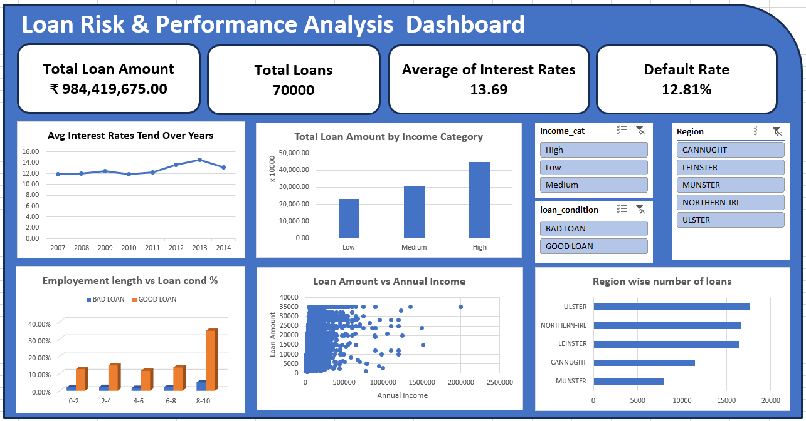

# ⚙️ Data Engineering & Analysis

## 📌 Objective

To build a complete data pipeline from **raw loan data to business insights**, including ETL processing, automation, and Excel-based analysis.

---

## 🔄 Pipeline Overview

Raw Dataset → SQL ETL → Cleaned Dataset → Excel Analysis → Dashboard

---

## 📂 Data Source

* Full Dataset: [https://docs.google.com/spreadsheets/d/1vVQvIubB_4z9GV3FpbRrbg7Vbk301iJRHyrpeL7NJGA/edit?usp=sharing]
* Sample Dataset:
  [sample_dataset.csv](../../data/sample/sample_dataset.csv)

---

## 🧱 Components

### 1. ETL Pipeline (Manual — SQLite + Colab)

Implemented using:

* SQLite (`sqlite3`)
* Python (Colab)

#### Steps:

* Created `loans` table
* Loaded dataset
* Performed data cleaning:

  * Missing value handling
  * Standardization
* Feature engineering:

  * `profitability`
  * `risk_flag`
* Created final table: `loans_cleaned`

👉 Notebook:

* [Manual ETL (Colab)](./etl_pipeline/etl_colab.ipynb)

---

### 2. ETL Automation (Cron-Based)

To simulate real-world pipelines, ETL was automated:

#### Approach:

* Local ETL script
* Scheduled using Cron

#### Purpose:

* Run ETL periodically (daily/weekly)
* Ensure updated dataset

👉 Files:

* [Automation Script](./etl_automation.py/)
* [Cron Setup](./etl_pipeline/cron_setup.md)

---

### 3. Excel-Based Exploratory Data Analysis

Analysis performed **entirely in Excel** (no Python EDA)

### 4. Excel Dashboard

Analysis performed using **Excel (no Python EDA)**.

#### Work Done:

* Solved **20 business questions**
* Performed:

  * Distribution analysis
  * Risk segmentation
  * Trend analysis
  * Correlation analysis

---

#### 📊 Files

* 📈 Excel Analysis File:
  [Open Excel File](./excel_dashboard/loan_analysis.xlsx)

---

#### 📸 Dashboard Preview

---
## 🎯 Key Outcomes

* Built end-to-end ETL pipeline
* Automated data processing using Cron
* Generated business insights using Excel
* Created dashboard for decision-making

---

## 🧠 Tools Used

* SQLite (`sqlite3`)
* Python (Colab)
* Excel
* Cron (Automation)
