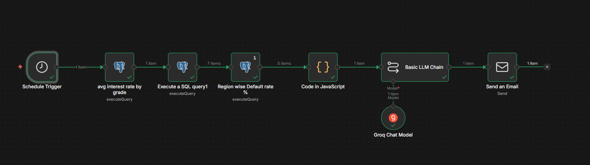
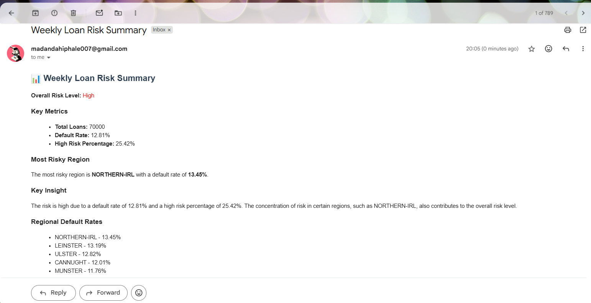
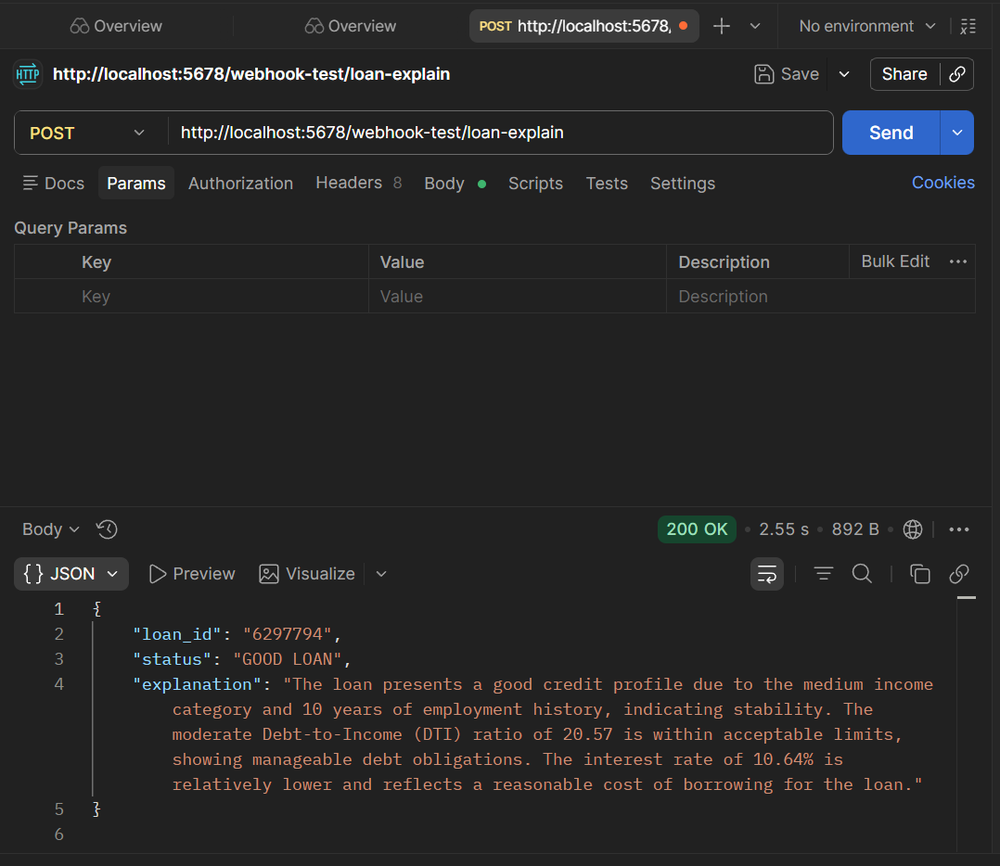
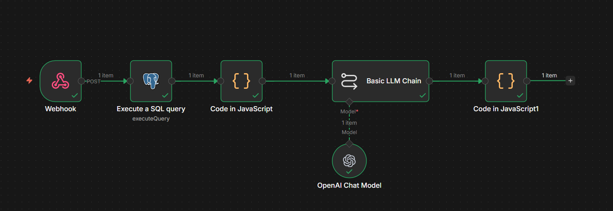

# 🤖 n8n + GenAI Automation — Loan Risk Intelligence

## 📌 Objective

To automate **loan risk monitoring and decision explanations** using **n8n workflows integrated with GenAI**, reducing manual effort and enabling faster, explainable decisions.

---

## 🧠 Problem Statement

* Risk managers don’t check dashboards daily
* Loan decisions lack clear explanations
* Manual analysis slows down response time

👉 Solution:

* Automate **weekly risk reporting**
* Build **AI-based loan explanation system**

---

# 🔄 Workflow 1: Weekly Loan Risk Summary

## 🎯 Goal

Automatically generate and send **weekly portfolio risk insights via email**

---

## ⚙️ Workflow Architecture

1. ⏰ **Schedule Trigger**

   * Runs weekly

2. 🗄️ **PostgreSQL Queries**

   * Fetch:

     * Avg interest rate by grade
     * Region-wise default %
     * Loan distribution

3. ⚙️ **Data Processing (JS Node)**

   * Format and structure metrics

4. 🤖 **GenAI (Groq Model)**

   * Input: Aggregated metrics
   * Prompt: Generate risk summary + insights
   * Output: Natural language explanation

5. 📧 **Gmail Node**

   * Sends automated email to stakeholders

---

## 🔁 GenAI Flow

* **Input:** SQL aggregated metrics
* **Prompt:** Risk summary + trend explanation
* **Output:** Human-readable email report

---

## 📸 Workflow

---

## 📊 Email Output

---

## 🧠 Insight Example

* High risk driven by elevated default rate
* Specific regions show higher concentration of defaults
* High-risk grades (D–F) contribute significantly

---

# 🔄 Workflow 2: Loan Decision Explainer (API-based)

## 🎯 Goal

Provide **real-time explanation** for a given loan using AI

---

## ⚙️ Workflow Architecture

1. 🌐 **Webhook (API Endpoint)**

   * Triggered via Postman
   * Input:

     * Loan ID

2. 🗄️ **PostgreSQL Query**

   * Fetch loan details:

     * Grade
     * Interest rate
     * DTI
     * Income category
     * Employment length

3. ⚙️ **Data Processing (JS Node)**

   * Structure input for AI

4. 🤖 **GenAI (OpenAI Model)**

   * Static prompt
   * Explains risk factors

5. 📤 **Response**

   * Returns JSON via webhook

---

## 🔁 GenAI Flow

* **Input:** Loan attributes
* **Prompt:** Explain loan risk reasoning
* **Output:** Structured explanation

---

## 📸 Workflow

---

## 📊 API Output (Postman)

---

## 🧠 Example Explanation

* Moderate DTI indicates manageable debt
* Stable employment improves reliability
* Lower interest rate suggests lower risk profile

---

# 📂 Repository Contents

* 📄 Workflow Files:

  * `weekly_risk_summary.json`
  * `loan_decision_explainer.json`

* 📸 Screenshots:

  * Workflow diagrams
  * Email output
  * API response

---

# 🎯 Business Value

* Eliminates manual reporting
* Provides automated risk monitoring
* Enables explainable AI decisions
* Improves operational efficiency

---

# 🛠 Tech Stack

* n8n (workflow orchestration)
* PostgreSQL (data source)
* Groq LLM (risk summarization)
* OpenAI (loan explanation)
* Gmail (email automation)
* Postman (API testing)
