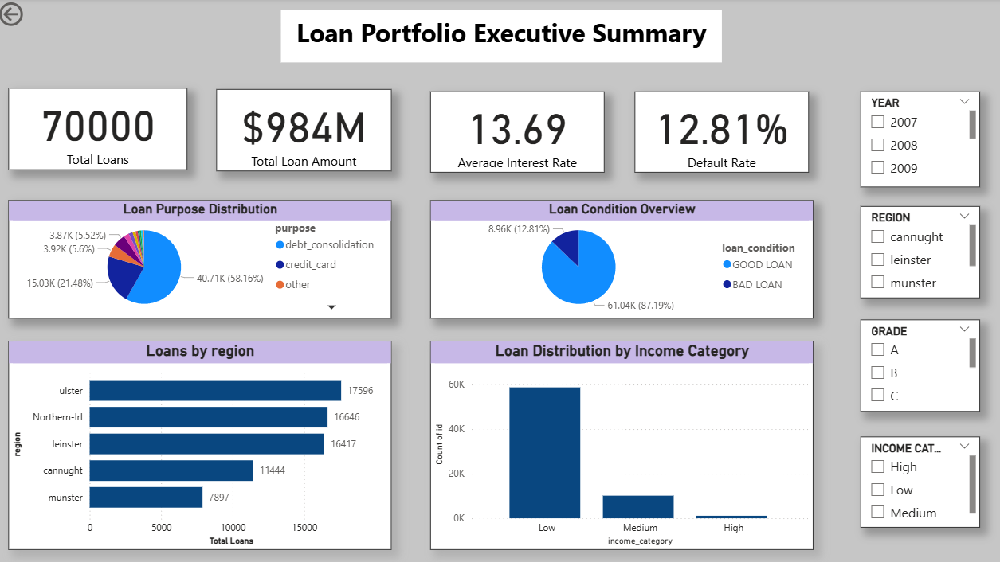
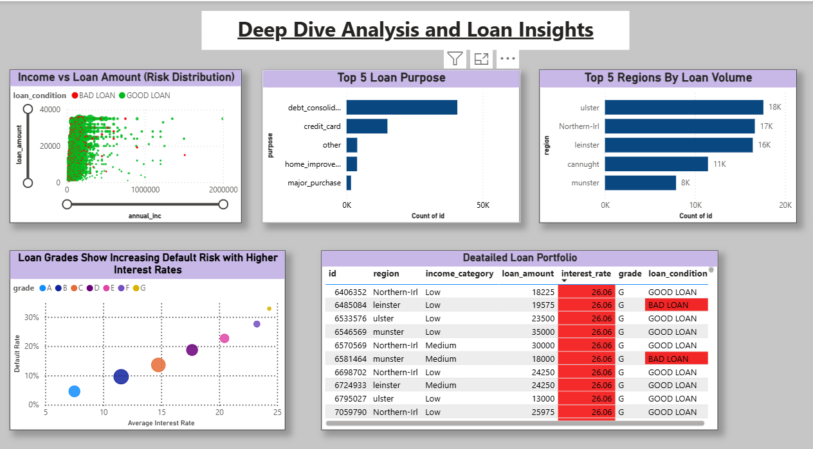
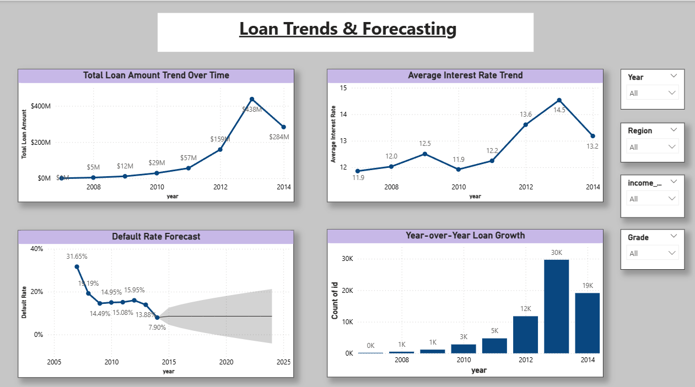
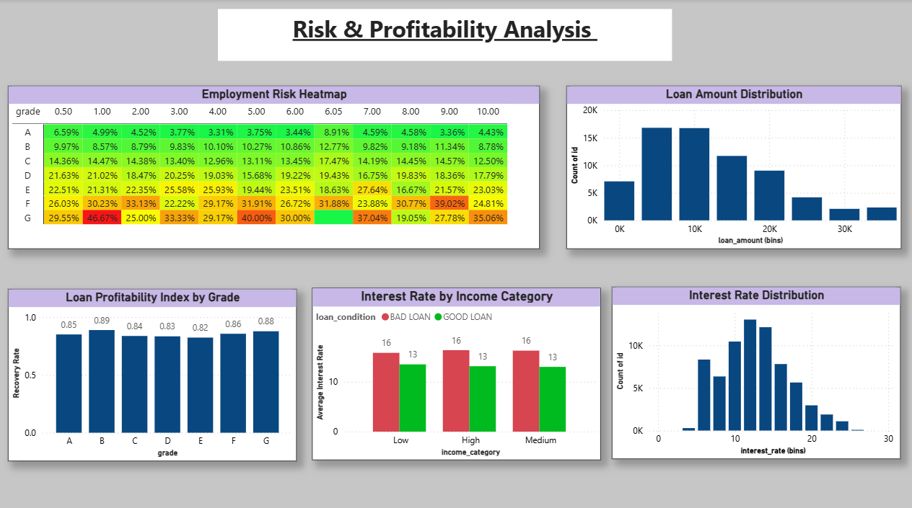

# 📊 Loan Risk & Performance Analytics Dashboard

## 📌 Objective
To build an end-to-end analytical dashboard that provides deep insights into loan performance, credit risk, borrower behavior, and portfolio trends.

This project combines:
- Data analysis
- Risk segmentation
- Business intelligence
- Automated insights (via n8n + GenAI)

---

## 📂 Project Structure
```
📁 project-root
┣ 📁 screenshots
┃ ┣ executive_summary.png
┃ ┣ deep_dive_analysis.png
┃ ┣ trends_forecasting.png
┃ ┗ risk_profitability.png
┣ 📄 dashboard.pbix
┣ 📄 README.md
```

---

## 📊 Dashboard Pages

### 1. Executive Summary
Provides a high-level overview of the loan portfolio.

Key Metrics:
- Total Loans
- Total Loan Amount
- Average Interest Rate
- Default Rate

Insights:
- Loan distribution by region
- Income category segmentation
- Loan condition (Good vs Bad)

---

### 2. Deep Dive Analysis & Loan Insights
Focuses on borrower behavior and risk distribution.

Key Analysis:
- Income vs Loan Amount (risk distribution)
- Top loan purposes (debt consolidation dominates)
- Regional loan concentration
- Interest rate vs default risk by grade

---

### 3. Loan Trends & Forecasting
Analyzes historical patterns and future risk signals.

Key Analysis:
- Loan growth over time
- Interest rate trends
- Default rate forecasting
- Year-over-year loan growth

---

### 4. Risk & Profitability Analysis
Examines risk-return trade-offs.

Key Analysis:
- Default risk by grade and employment length
- Loan profitability by grade
- Interest rate distribution
- Income vs interest rate behavior

---

## 📈 Key Insights

- Default risk increases significantly with lower credit grades (D–G)
- Borrowers with shorter employment history show higher default probability
- Portfolio is geographically concentrated, increasing regional risk exposure
- High-risk loans (E–G) generate higher returns but increase default exposure
- Default rate (~12.8%) indicates moderate-to-high portfolio risk

---

## 🧠 Features

- Interactive filters (Year, Region, Grade, Income Category)
- Multi-page analytical storytelling
- Risk segmentation using business logic
- Forecasting-based insights
- Clean KPI-driven design

---

## 🛠 Tools & Technologies

- Power BI
- PostgreSQL (data storage)
- n8n (workflow automation)
- GenAI (automated risk explanation)
- SQL (data transformation)

---

## 🎯 Outcome

- Enables data-driven decision-making for risk managers
- Identifies high-risk borrower segments
- Balances profitability vs risk exposure
- Automates reporting using AI workflows

---

## 📸 Dashboard Preview

### Executive Summary


### Deep Dive Analysis


### Trends & Forecasting


### Risk & Profitability


---

## 🚀 Future Improvements

- Real-time dashboard integration
- Advanced ML-based default prediction
- API-based deployment
- Alert system for high-risk loans
